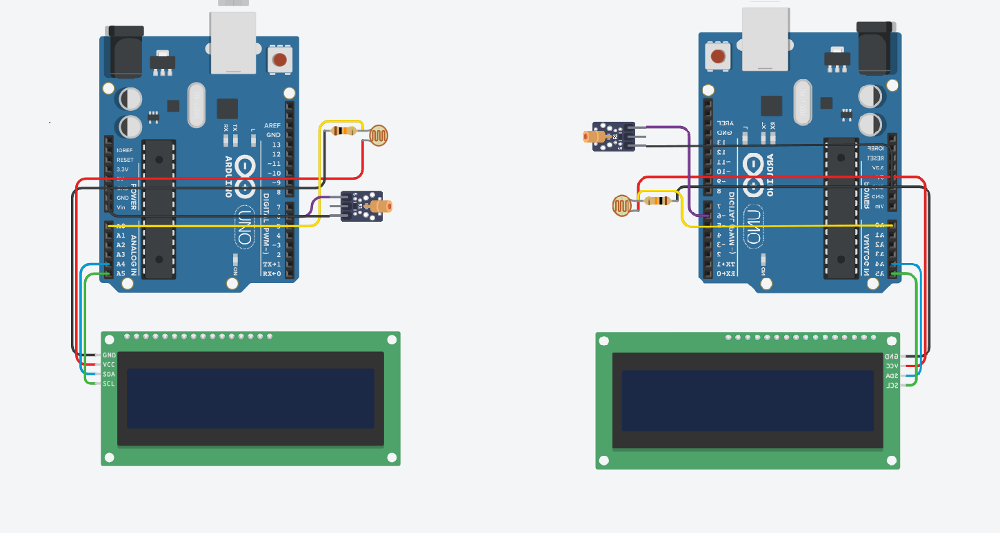

This project is a Laser Morse Code Encoder and Decoder system designed to facilitate secure and efficient communication using light signals. Leveraging the simplicity and reliability of Morse code, the system encodes text messages into Morse signals transmitted via a laser, and decodes incoming laser signals back into readable text using a photoresistor (LDR) sensor.

# Overview
Morse code, a time-tested method for encoding textual information into sequences of dots and dashes, provides a minimalistic yet effective communication protocol. By combining this with laser technology, this project aims to establish a line-of-sight optical communication channel that can be used in various scenarios where radio or network-based communications are unavailable, restricted, or undesirable.

**Key Features**
 * Encoding: Converts plain text into Morse code signals, modulating a laser beam to represent dots (short pulses) and dashes (long pulses).

 * Decoding: Uses an LDR sensor to detect incoming laser pulses, interprets the Morse sequences, and reconstructs the original text message.

 * Arduino-Based: Utilizes Arduino microcontrollers to interface with the laser transmitter and LDR receiver, providing a cost-effective and accessible hardware solution.

 * Real-Time Communication: Enables near-instantaneous encoding and decoding, suitable for interactive messaging or data transmission.

 * Compact and Portable: The hardware setup is minimal, easily transportable, and deployable in field conditions or educational environments.

 * Extensible: The system architecture supports future enhancements, such as integration with wireless modules, encryption, or automated error correction.

# Use Cases 
 * Educational Tool: Demonstrates fundamental principles of optical communication, encoding, and decoding, ideal for students and hobbyists.

 * Secure Communication: Line-of-sight laser messaging offers a stealthy and secure alternative to conventional wireless communication.

 * Remote Data Transfer: Useful in environments where radio signals are jammed or prohibited, such as certain industrial or military settings.

 * Experimentation Platform: Serves as a base for developing advanced communication protocols or experimenting with signal processing techniques.

# Technical Details
The project employs the Arduino platform for precise timing and control of the laser emitter and LDR sensor. The encoder module transforms user input into Morse code sequences, driving the laser accordingly. The decoder module continuously samples the LDR sensor’s analog values, filters noise, detects pulse lengths, and converts these pulses back into characters.

# How to Use
1. Connect the laser transmitter and LDR sensor to the Arduino boards as per the wiring diagram.

2. Upload the encoder code to the transmitter Arduino and the decoder code to the receiver Arduino.

3. Input text messages via serial monitor or other input methods to be sent over laser.

4. Receive and read decoded messages on the receiver side.

# Schematic

